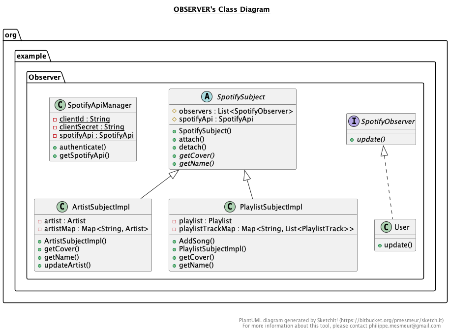

# 🎶 Spotify Notifier 🌟

## 🚀 Overview
This innovative program enables users to seamlessly follow artists and manage playlists on Spotify. Receive instant notifications for new song releases by your favorite artists or when tracks are added to your followed playlists.

## 🖥️ How to Use

### 🌌 Setup and Run with IntelliJ
1. **Clone the Repository**
   - `git clone git@github.com:JuanDiego34/DP-P7-SpotifyNotifier.git`
2. **Open in IntelliJ**
   - Launch IntelliJ IDEA.
   - Click `Open or Import`.
   - Navigate to the cloned repository and select the project directory.
3. **Maven Configuration**
   - Ensure Maven is configured in IntelliJ.
   - In `Project Structure`, set the JDK to Java 11 or compatible version.
   - IntelliJ should automatically detect and load the Maven project.
4. **Run the Application**
   - Navigate to `src/main/java/org/example/MainGUI.java`.
   - Right-click and select `Run 'MainGUI.main()'`.

### 🖱️ Run via Terminal
1. **Clone the Repository**
   - `git clone git@github.com:JuanDiego34/DP-P7-SpotifyNotifier.git`
2. **Navigate to Project Directory**
   - Open terminal.
   - Change directory to `src/main/java/org/example`.
3. **Compile and Run**
   - Compile: `javac MainGUI.java`.
   - Run: `java MainGUI`.

## 🌐 More Information
This program utilizes the Spotify Web API Java client, which can be found [here](https://github.com/spotify-web-api-java/spotify-web-api-java/tree/master).

## 🚀 Project Structure

Developed in Java, this project includes:
1. **GUI Branch**: Focuses on the graphical user interface.
2. **Observer Pattern Branch**: Implements observer patterns for real-time updates.
3. **Artists Functionality Branch**: Manages artist-related features.
4. **Playlists Functionality Branch**: Oversees playlist functionalities.

## 🤔 How It Works

## 👥 Team

The developers of this project are:
- **Eduardo Jose Barrios Garcia**
  - 📧 [eduardojbarriosgarcia@gmail.com](mailto:eduardojbarriosgarcia@gmail.com)
- **Juan Diego Rendon Cachafeiro**
  - 📧 [ejemplo@ull.edu.es](mailto:ejemplo@ull.edu.es)
- **Oleg Petrov**
  - 📧 [example@example.com](mailto:example@example.com)

